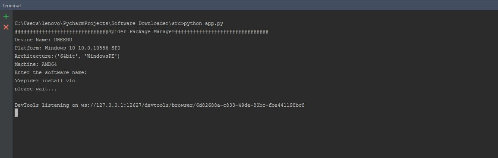
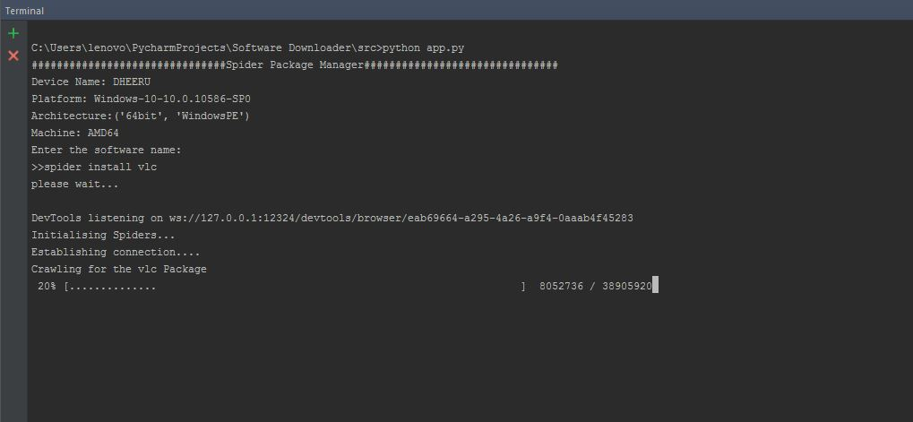
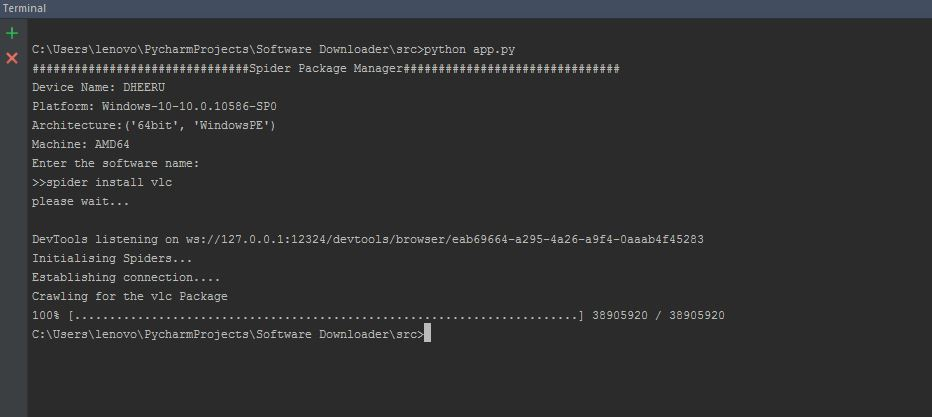
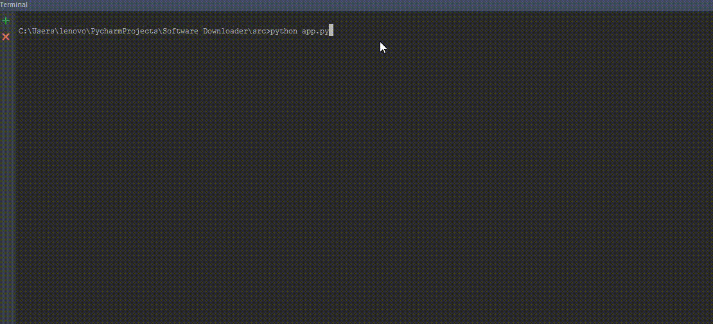

# Spider Package Manager
Designed and developed a package manager for Windows Operating Systems with security permissions.

## Getting Started

These instructions will get you a copy of the project up and running on your local machine for development.

### Prerequisites

* Install the [Python](https://www.python.org/) in your PC.
* Install the [pip](https://pypi.org/project/pip/)

### Installing

A step by step series of examples that tell you how to get a development env running.
* Open the terminal or powershell and go to the project path and type the below command


```

  cd src

```

```
  pip install -r requirements.txt 
  
```


* open terminal or powershell and enter the below command

```
python app.py
```


## Built With

* [Python](https://www.python.org/)  

## Screenshots

   
   
   
   
  
## License
This project is licensed under the MIT License - see the LICENSE.md file for details
  
  
## Authors

* **Srirama Dheeraj** - [DheerajRam13](https://github.com/dheerajram13/)
